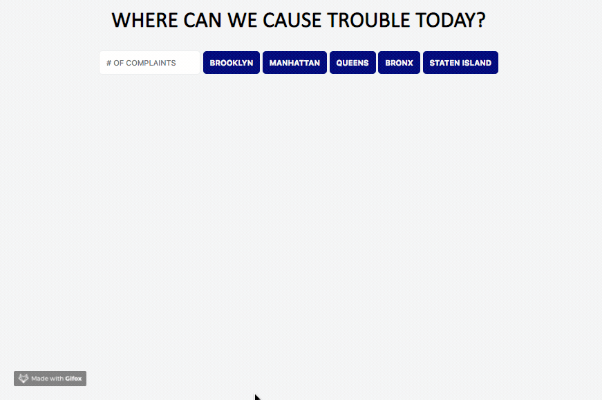

#### M1W4- HW2 ####
Using **fetch** JavaScript function to get data form an API endpoint.
  

***INSTRUCTIONS:***

**Getting Started**

- Create a directory named complaints_app
- Inside that directory, create app.js, index.html, and styles.css files
- Link them up and make sure all things are connected correctly.

**The App**

Overall, what this app does is to search through the 311 call data provided by the NYC Open Data API, and display all the complaints made to the NYPD, filtered by borough. It also shows how the police responded to the complaint.

**API documentation**

<https://dev.socrata.com/foundry/data.cityofnewyork.us/fhrw-4uyv>

**The Data**

For this particular API, NYC Open Data, the data sent after making the fetch call is formatted as JSON.

**Minimum Viable Product (MVP)**

Below is a more detailed list of the app functionality.

1. Users should be able to see five buttons for the five boroughs (manhattan, brooklyn, queens, staten island, bronx) of New York City when they load the page
2. Users should also be able to see an input box where they can put in a number of how many complaints they want to see
3. When the user clicks on one of the five buttons, a list of complaints should be displayed on the page, according to the number they input AND the borough they clicked on
	- If the user doesn't input any number, make the default be 10
	- Remember, also, they only want complaints that were handled by the NYPD
	- When the list of complaints is shown, each complaint should also have a button on it that reads something along the lines of "What did police do?"
	- When the user clicks on on the "What did police do?" button, it should then toggle how the police responded to that particular complaint
	- Make sure it only toggles the response for that one complaint, not the entire list.

**Example of a working app**

**Bonus Points**

- Make it so the complaints are listed in alphabetical order.
- You'll notice the complaint descriptors fall under umbrella categories (e.g. "No Access", "Banging/Pounding", "Loud Music/Party", etc. etc.)
	- Display somewhere on the page all the categories and how many times they show up for the current list of complaints
	- e.g. "No Access was complained about 4 times", "Banging/Pounding was complained about 10 times", "Loud Music/Party was complained about 20 times"

