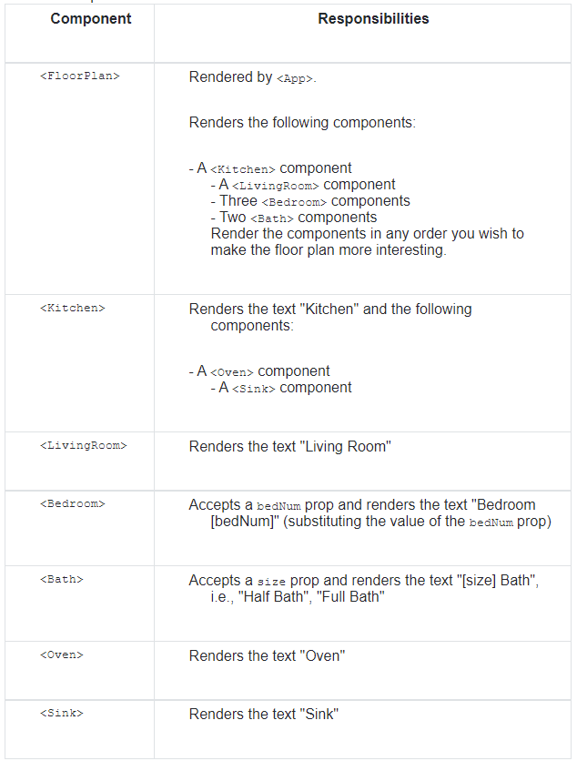
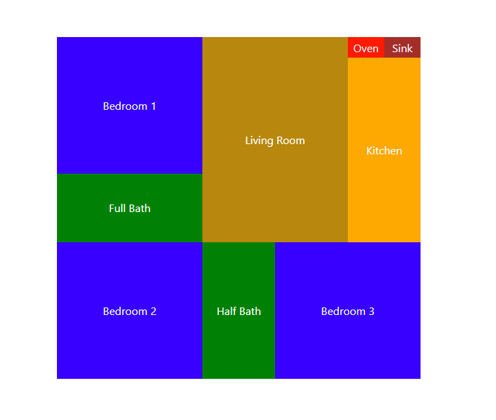
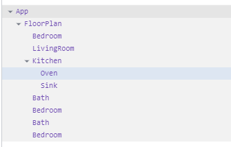

## w3d1 - hw - (Floor Plan)

The purpose of this homework is to practice the following concepts:
- How to define components as functions
- How to return a function component's UI defined using JSX
- How to pass props to components
- How to access the properties on props within a component

**INSTRUCTIONS**

1. Define each component in its own file. The naming convention to use for a component's file is UpperCamelCase also known as Pascal Case, for example, a <CodeSandbox> component's file would be named CodeSandbox.js (CodeSandbox.jsx also works).

2. Export each component from its module. For example:

```
// CodeSandbox.js

 import React from 'react';

 function CodeSandbox(props) {
   return (
     <div>
       <h1>CodeSandbox</h1>
     </div>
   );
 }

 // Must export the component's function (or class)
 export default CodeSandbox;
 ```

 3. Define the following components as functions and code them such that they fulfill their responsibilities:


4. Bonus: Style the components to make the output look like a floor plan.

**FINAL PRODUCT**



**Components hierarchy:**


