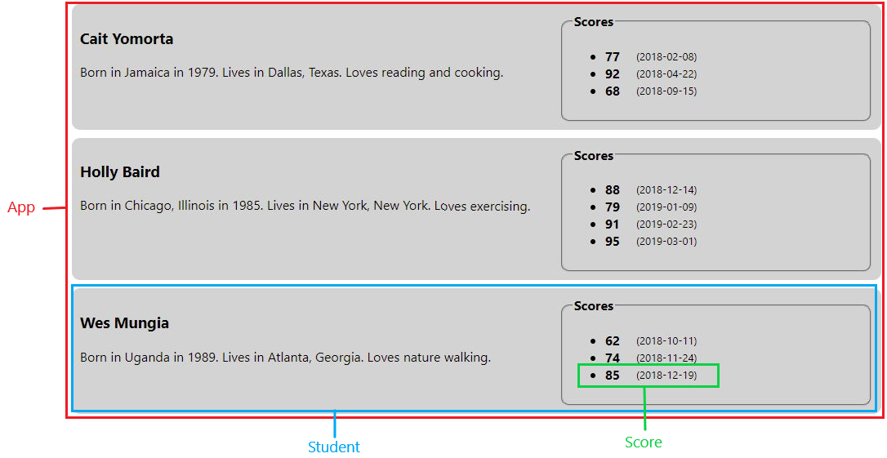

## React "Students" Homework.

On this homework I will practice the following topics:

- **Initialize state using `useState` React Hook.**
- How to pass info as `props` from a parent to a child component.
- How to map arrays of info to components.
- How to use function components to render info provided as `props`.

### INSTRUCTIONS ###

1. Use the following array of "student" data to initialize state as an object with a `students` key in the `<App>` component:

```
[
  {
    name: 'Cait Yomorta',
    bio: 'Born in Jamaica in 1979. Lives in Dallas, Texas. Loves reading and cooking.',
    scores: [
      {
        date: '2018-02-08',
        score: 77
      },
      {
        date: '2018-04-22',
        score: 92
      },
      {
        date: '2018-09-15',
        score: 68
      }
    ]
  },
  {
    name: 'Holly Baird',
    bio: 'Born in Chicago, Illinois in 1985. Lives in New York, New York. Loves exercising.',
    scores: [
      {
        date: '2018-12-14',
        score: 88
      },
      {
        date: '2019-01-09',
        score: 79
      },
      {
        date: '2019-02-23',
        score: 91
      },
      {
        date: '2019-03-01',
        score: 95
      }
    ]
  },
  {
    name: 'Wes Mungia',
    bio: 'Born in Uganda in 1989. Lives in Atlanta, Georgia. Loves nature walking.',
    scores: [
      {
        date: '2018-10-11',
        score: 62
      },
      {
        date: '2018-11-24',
        score: 74
      },
      {
        date: '2018-12-19',
        score: 85
      }
    ]
  }
]
```

2. Code the `<App>` component to display a `<Student>` component for each student object in the students array being held in state.
3. Code the `<Student>` component so that it:
    - Renders the student's name & bio properties
    - Renders a `<Score>` component for each score object in the student's scores property.
4. Code the `<Score>` component so that it renders the score object's date & score properties.

### FINAL PRODUCT ###



#### React functional components hierarchy:
- App
  - Student
    - Score


