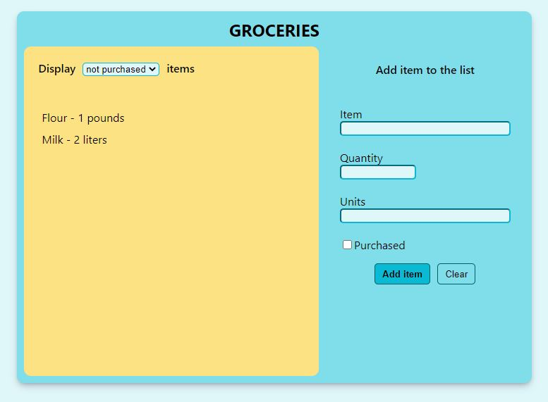
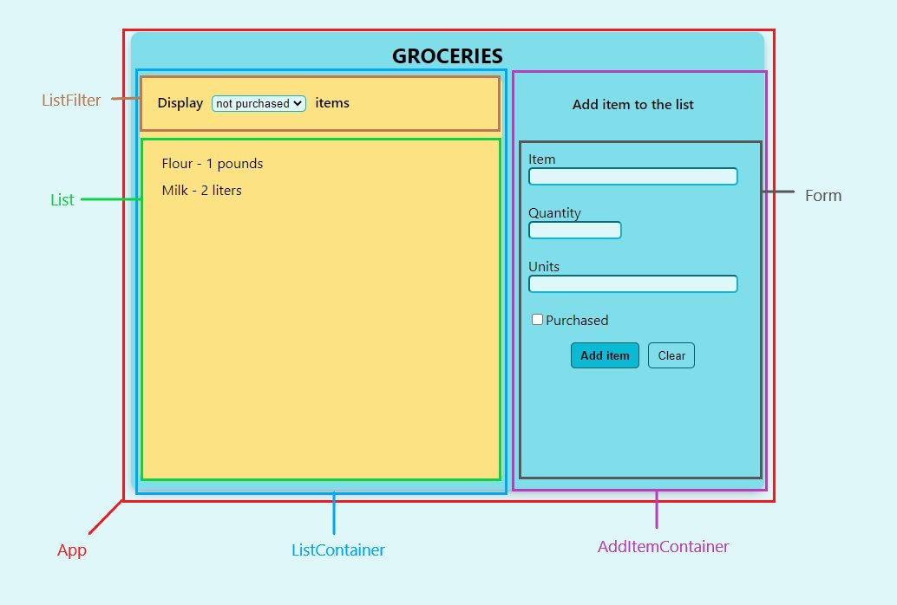

#### w1 - hw2 - (Groceries) #### 
Build a React app that lets you make a list of groceries to buy.

***Learning Objectives***
- Setting up a React app
- Using state
- Rendering a list
- Conditional rendering
  
----

***INSTRUCTIONS***

The groceries array in your state must have objects representing grocery items:
```
state = {
    groceries: [
        {
            item: '',
            units: '',
            quantity: 0,
            isPurchased: false
        }
    ]
}
```
1. Add 3 objects to the state and render each objects properties (item, quantity and units) as a list i.e (Apples - 12 pack, Flour - 1 lb, Milk - 2 liters, etc.)
2. Make inputs so that new items can be added to the list.
3. Conditionally render the grocery items based on whether or not they were purchased or not.
4. Add style to your React app.

----

***FINAL PRODUCT***



**REACT COMPONENTS OF THE APPLICATION**



**React components hierarchy**

- App
  - ListContainer
    - ListFilter
    - List
  - AddItemContainer
    - Form

**App** component has a state that contains an array of objects *groceries*, representing the grocery items in the list. It has a *addItem* member function that adds an object to the array. 
It renders a *ListContainer* component and a *AddItemContainer* component.
The *groceries* array on the state is passed with *props* to the *ListContainer* child. The function *addItem* is passed as a callback function, using *props*, to the *AddItemContainer* child.

**ListContainer** component has a state that contains a String *filter* representing the kind of filter applied to the items shown in the list. It has a *handleFilterChange* member function that modifies the value of *filter* on the state.
It renders a *ListFilter* component and a *List* component.
The *filter* String on the state and the *groceries* array from *App* component state are passed with *props* to the *List* child. The function *handleFilterChange* is passed as a callback function, using *props*, to the *ListFilter* child.

**ListFilter** component does not have a state. 
It has a member function *handleChange* that calls the callback function *handleFilterChange* from the *ListContainer* component.
It renders a dropdown menu with three options: *not purchased*, *purchased* and *all*, allowing the user to select the kind of filter he wants to apply to the items displayed on the list.

**List** component does not have a state.
It displays the items on the *groceries* array from *App* component state, filtered by the *filter* String on *ListContainer* state.

**AddItemContainer** component does not have a state. 
It renders a *Form* component.
It passes the *addItem* callback function from the *App* component to the *Form* child component.

**Form** component has a state that contains an object with the values of the form inputs. It has four member functions: *handleInputChange* that saves the input values on the state everytime the users changes an input value, *handleAddItemClick* that calls the *App* component *addItem* callback function passing the object on *Form* state as an argument, *handleFormReset* that calls a helper function to clear the input fields, and *clearState* that clears the values on the state.
It renders a form that lets the user input the values of an item and then add the item to the list.


