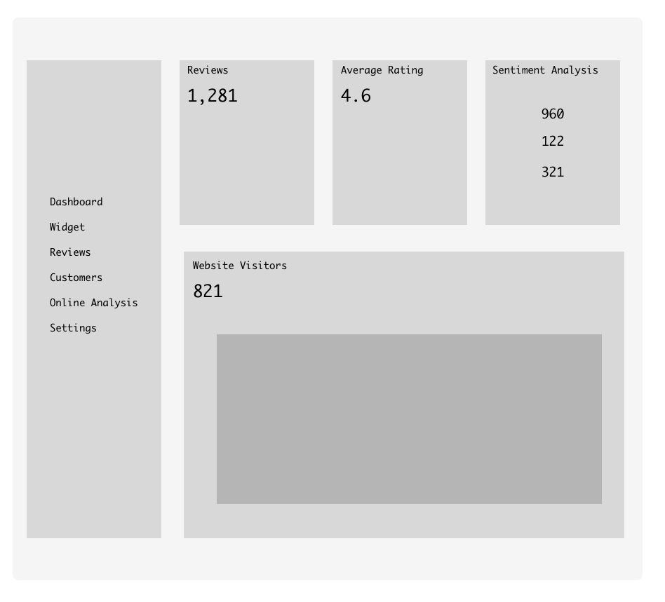

#### W1-HW1 ####
Using ***React Functional*** Components.
  

***INSTRUCTIONS:***

1. Recreate this wireframe with React. Be sure to create a few functional components (e.g. app, sidebar, etc).
2. Reuse components where necessary (For example: Reviews, AverageRating, and Sentiment Analysis could be one component accepting different props).
3. Make use of props to populate the number values for each component.
4. Add more details, add some css.

**Wireframe to recreate:**

