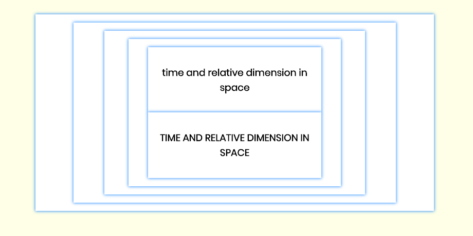

#### w1 - hw3 - (T.A.R.D.I.S) ####
Using ***React Class Components***. 
The purpose of this homework is to let me understand the way React Class Components work and 
interact with each other on a application.

----
***[THINKING IN REACT](https://reactjs.org/docs/thinking-in-react.html)***

**Start With A Mock**

When clicking on one of the texts displayed inside of the innermost containers, the text has to update from uppercase to lowercase or visceversa. Each text should update independently.

**Step 1: Break The UI Into A Component Hierarchy**
- App
  - DivOne
    - DivTwo
      - DivThree
      - DivThree

**Step 2: Build A Static Version in React**

I build a static version of the app that renders the previous data model.

For that purpose I build a React Class component for each of the components on the previous hierarchy (*App*, *DivOne*, *DivTwo* and *DivThree*).

On *index.js* I created a constant with the text to display, and passed it using *props* to its child *App* component, and from there down on the hierarchy to *DivThree* using *props* too. *DivThree* displays the text inside an *h3* HTML tag. I understand that that constant can be placed on the innermost component (*DivThree*),
but for the purpose of practicing I am using props to pass it from parent to child.

I did not use *state* on this step since state is reserved for interactivity, that is, data that changes over time. Since this is a static version of the app, I didn't need it.

**Step 3: Identify The Minimal (but complete) Representation Of UI State**

I identified two pieces of data used in this application:
- The text that is displayed on the two innermost containers. *This text does not change over time and it is passed in as props, so it is not state.*
- A flag that indicates if the text displayed is uppercase or lowercase. *This flag needs to change over time and can't be computed from anything, so **it is state**.*

**Step 4: Identify Where Your State Should Live**

Since the innermost container (*DivThree*) is the only element that needs to keep track of its text's uppercase 
or lowercase state, and this container does not need to communicate or pass data to other siblings or parent, 
I will place the state on it.

**Step 5: Add Inverse Data Flow**

This app does not need to have inverse data flow since the innermost component (*DivThree*) is not sending
any data to its parent or siblings. In more complex apps, inverse data flow can be achieved by passing callback functions as props, from parent to child elements. That way, the parent will be the only one that will update its own state. 

